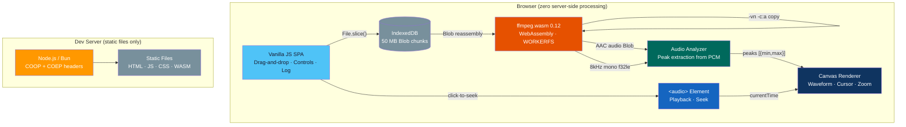

# Audio Waveform

Browser-only audio extraction and waveform visualization from large video files. Upload videos up to 5 GB, extract audio with ffmpeg.wasm, and render interactive waveforms — no server-side processing.

---

## Features

| Category | Feature | Status |
|----------|---------|--------|
| **Upload** | Drag-and-drop or file picker for video files | :white_check_mark: |
| | Chunked IndexedDB storage (50 MB chunks, up to 5 GB) | :white_check_mark: |
| | Storage quota monitoring | :white_check_mark: |
| | Persistent across page reloads | :white_check_mark: |
| **Extraction** | Audio track extraction via ffmpeg.wasm (stream copy, no re-encoding) | :white_check_mark: |
| | WORKERFS mount for files > 1.5 GB (avoids ArrayBuffer limit) | :white_check_mark: |
| | Multi-threaded with single-threaded fallback | :white_check_mark: |
| | Progress reporting | :white_check_mark: |
| **Analysis** | ffmpeg-based downsampling (8 kHz mono float32 PCM) | :white_check_mark: |
| | Peak extraction for waveform rendering | :white_check_mark: |
| | Memory-efficient — never loads full audio into heap | :white_check_mark: |
| **Visualization** | Canvas-based mirrored waveform | :white_check_mark: |
| | Amplitude color coding (blue/green/orange/red) | :white_check_mark: |
| | Zoom in/out and fit-to-width | :white_check_mark: |
| | Click-to-seek with playback cursor | :white_check_mark: |
| | Auto-scroll during playback | :white_check_mark: |
| **Playback** | Audio playback via `<audio>` element | :white_check_mark: |
| | Synchronized cursor with `requestAnimationFrame` | :white_check_mark: |
| | Play/pause and seek controls | :white_check_mark: |

## Tech Stack

| Layer | Technology |
|-------|-----------|
| **Frontend** | Vanilla JS (ES modules), HTML5, CSS3 |
| **Audio Extraction** | [ffmpeg.wasm](https://github.com/ffmpegwasm/ffmpeg.wasm) 0.12 (WebAssembly) |
| **Audio Analysis** | Web AudioContext API, ffmpeg downsampling |
| **Rendering** | HTML5 Canvas (device-pixel-ratio aware) |
| **Storage** | IndexedDB (chunked Blob storage) |
| **Dev Server** | Node.js or [Bun](https://bun.sh/) (COOP/COEP headers) |

## Architecture



## Quick Start

```bash
# Install dependencies (ffmpeg.wasm served locally)
bun install          # or: npm install

# Start dev server (pick one)
bun server.bun.js    # Bun
node server.js       # Node.js

# Open http://localhost:3000
```

> **Note:** The dev server sets `Cross-Origin-Opener-Policy: same-origin` and `Cross-Origin-Embedder-Policy: require-corp` headers, required for ffmpeg.wasm's SharedArrayBuffer support.

## Scripts

| Command | Description |
|---------|-------------|
| `bun server.bun.js` | Start Bun static server on port 3000 |
| `node server.js` | Start Node.js static server on port 3000 |
| `bun run start` | Alias for `node server.js` |
| `bun run start:bun` | Alias for `bun server.bun.js` |

## Browser Requirements

| Requirement | Why |
|-------------|-----|
| SharedArrayBuffer | ffmpeg.wasm multi-threaded mode |
| COOP/COEP headers | SharedArrayBuffer prerequisite |
| IndexedDB | Chunked file storage |
| WebAssembly | ffmpeg.wasm runtime |
| Web AudioContext | Audio decoding fallback |
| Canvas 2D | Waveform rendering |

Tested on: Chrome 120+, Firefox 120+, Edge 120+. Safari has limited SharedArrayBuffer support — ffmpeg falls back to single-threaded mode.

## Documentation

| Document | Description |
|----------|-------------|
| [Architecture](docs/architecture.md) | Processing pipeline, data flow, memory strategy |
| [Storage](docs/storage.md) | IndexedDB chunking, quota management, Blob reassembly |
| [Audio Extraction](docs/extraction.md) | ffmpeg.wasm loading, WORKERFS mount, codec strategies |
| [Waveform](docs/waveform.md) | Analysis, peak extraction, canvas rendering, playback sync |

## Known Limitations

- Files > 2 GB require WORKERFS mount (automatic) — extraction speed depends on browser I/O
- `Blob.arrayBuffer()` limited to ~2 GB in most browsers — handled via WORKERFS fallback
- ffmpeg.wasm single-threaded mode is significantly slower (used when SharedArrayBuffer is unavailable)
- Audio analysis decodes to 8 kHz mono — sufficient for waveform visualization, not for high-fidelity analysis

## License

MIT
