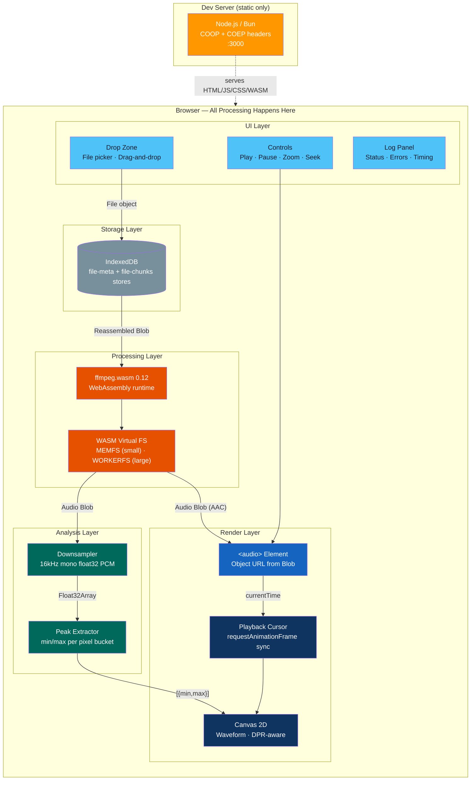
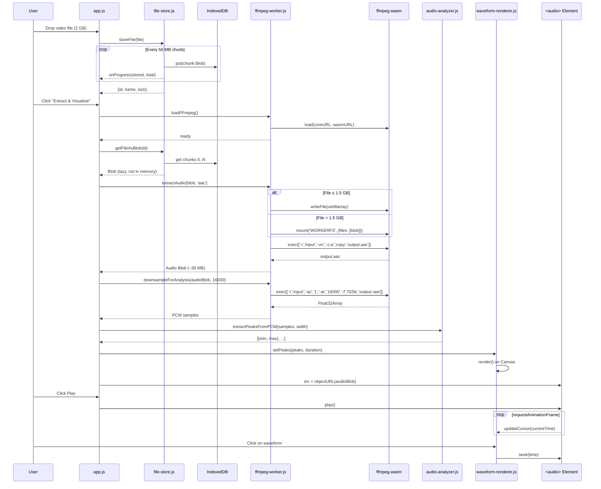
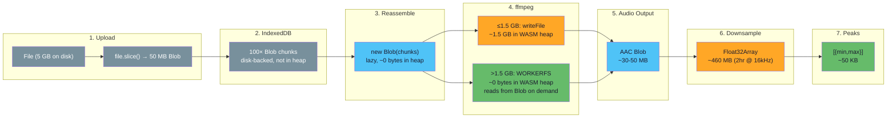
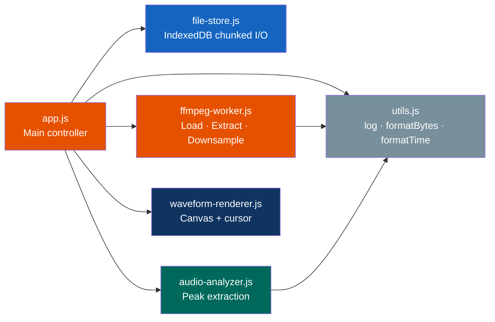

# Architecture

## System Overview



All audio extraction, analysis, and rendering happens in the browser. The server exists only to serve static files with the correct COOP/COEP headers required for SharedArrayBuffer.

## Processing Pipeline



## Memory Strategy

Large video files are the primary challenge. This diagram shows how memory is managed at each stage:



**Key insight:** At no point is the full 5 GB video loaded into JavaScript heap memory. IndexedDB stores disk-backed Blobs, `new Blob(chunks)` is lazy, and WORKERFS lets ffmpeg read from the Blob on demand.

## Module Structure



| Module | Responsibility | Key APIs |
|--------|---------------|----------|
| `app.js` | Wires everything together, handles UI events | DOM events, pipeline orchestration |
| `utils.js` | Logging, formatting, DOM helpers | `log()`, `formatBytes()`, `setProgress()` |
| `file-store.js` | Chunked IndexedDB storage | `storeFile()`, `getFileAsBlob()`, `deleteFile()` |
| `ffmpeg-worker.js` | ffmpeg.wasm lifecycle, audio extraction | `loadFFmpeg()`, `extractAudio()`, `downsampleForAnalysis()` |
| `audio-analyzer.js` | Peak extraction from PCM data | `extractPeaksFromPCM()` |
| `waveform-renderer.js` | Canvas rendering, zoom, playback cursor | `WaveformRenderer` class |

## COOP/COEP Headers

ffmpeg.wasm's multi-threaded mode uses `SharedArrayBuffer`, which requires cross-origin isolation:

```
Cross-Origin-Opener-Policy: same-origin
Cross-Origin-Embedder-Policy: require-corp
```

Both `server.js` (Node.js) and `server.bun.js` (Bun) set these headers on every response. Without them, the browser falls back to single-threaded ffmpeg (slower but functional).

For production deployment on Netlify, Cloudflare Pages, or similar, configure these headers in the platform's `_headers` file or equivalent.
