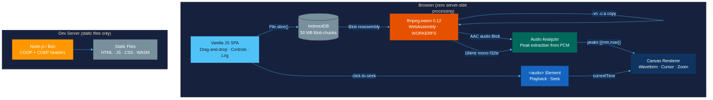
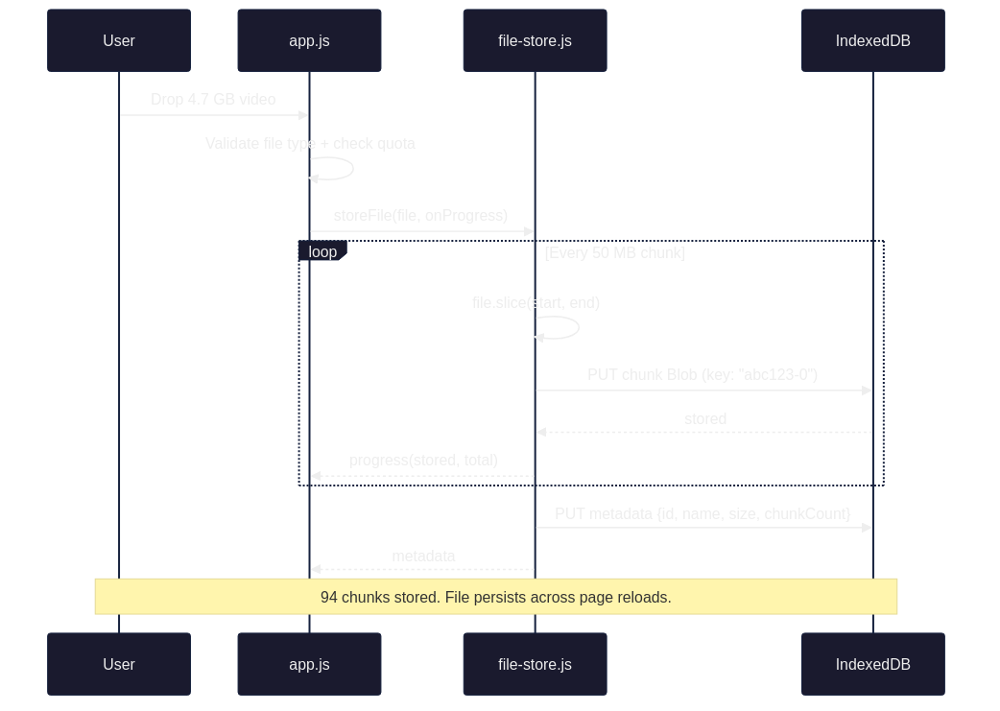
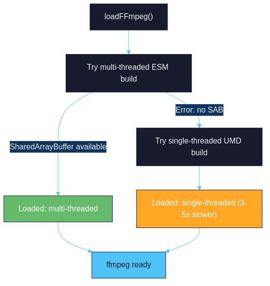
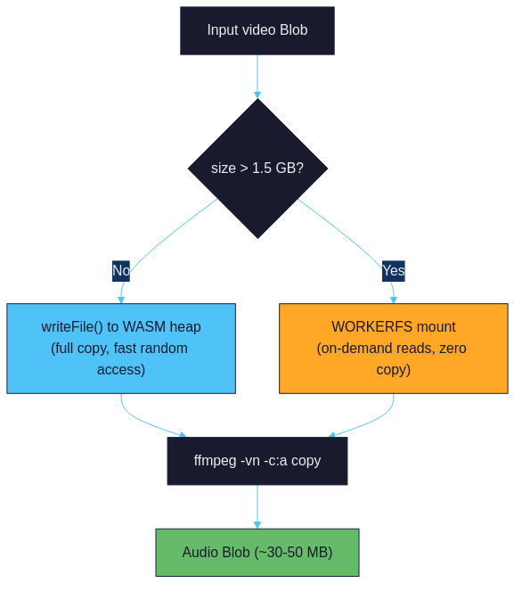
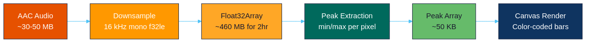
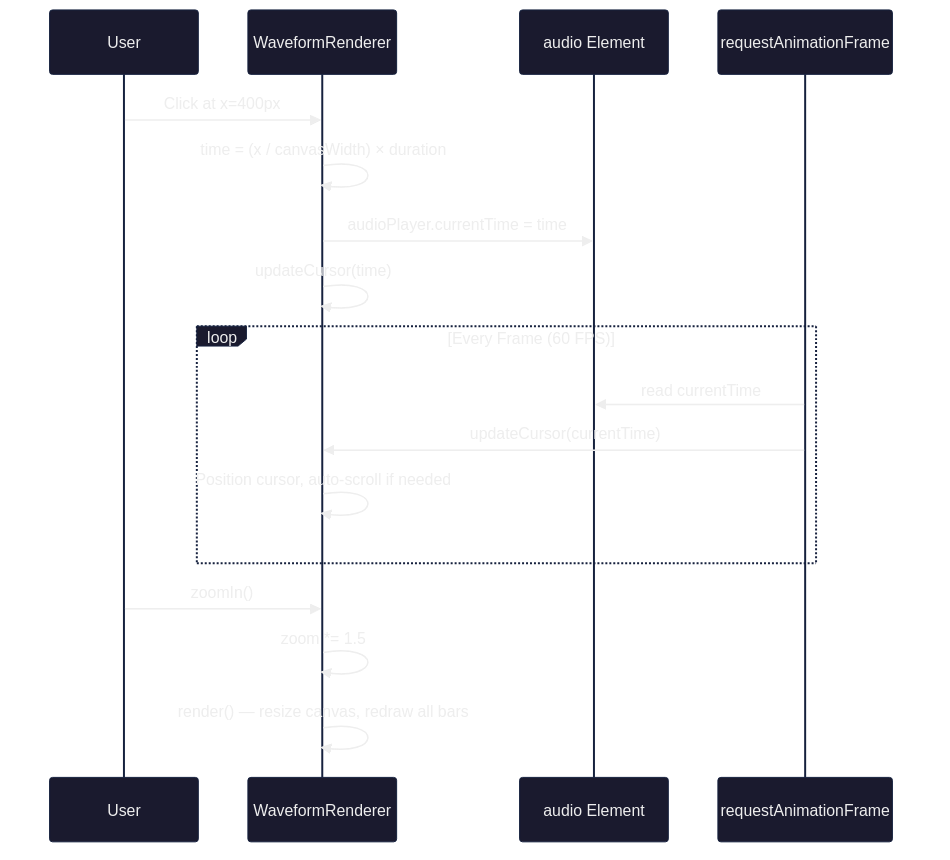
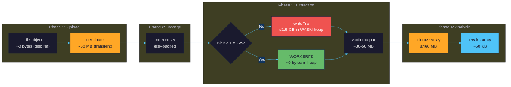

# Audio Waveform: How I Made My Browser Process 5GB Videos Without Catching Fire

*Extracting audio and rendering waveforms from massive video files — entirely client-side, because uploading 5GB to a server felt like dial-up energy.*

---

[](https://youtu.be/nZe-znRpLik)

> Watch the demo: a **3 GB MP4** processed entirely in the browser — [youtu.be/nZe-znRpLik](https://youtu.be/nZe-znRpLik)

---

So here's the thing. I had a 4.7 GB MKV file. A 3-hour conference recording. I needed to find the exact timestamp where the speaker said "we're pivoting to blockchain" so I could clip it and send it to everyone as evidence of corporate insanity.

Every online tool either had a 500 MB upload limit, wanted me to create an account, or uploaded my file to some random server. "Don't worry, we delete it after processing!" Sure you do, random-video-converter.io. Sure you do.

So I did what any reasonable developer does. I opened VS Code and started typing `indexedDB.open()`.

Two days later, I had a browser app that eats 5 GB video files for breakfast, extracts audio in seconds (not minutes), and renders interactive zoomable waveforms. All running in a browser tab. Zero server processing. Your files never leave your machine.

I call it [Audio Waveform](https://github.com/gjovanov/audio-waveform), and it's the most over-engineered solution to a simple problem I've built this month.

---

## The Problem

"Just use ffmpeg" — yes, I know. And I do. On my machine. But I wanted something I could:

1. **Share with non-technical people** — "open this URL and drag your file"
2. **Use from any device** — no installation, no PATH variables, no "which ffmpeg"
3. **Keep private** — no file uploads, no third-party processing
4. **Handle huge files** — not "up to 200 MB", actual big files

The pieces existed: [ffmpeg.wasm](https://github.com/ffmpegwasm/ffmpeg.wasm) runs ffmpeg in WebAssembly, IndexedDB can store gigabytes, Canvas can draw anything. Nobody had glued them together for large files though, because — as I discovered — "large files in the browser" is where things get spicy.

---

## Architecture



The "server" in this diagram is a liar. It serves static files. That's it. HTML, JS, CSS, and WASM binaries. Your video data never touches it. The server's only real job is setting two HTTP headers. Two. That's its entire personality.

---

## The Stack

| Layer | Choice | Why |
|-------|--------|-----|
| **Frontend** | Vanilla JS ([ES modules](https://developer.mozilla.org/en-US/docs/Web/JavaScript/Guide/Modules)) | No framework. No build step. Just `<script type="module">` |
| **Audio** | [ffmpeg.wasm](https://github.com/ffmpegwasm/ffmpeg.wasm) 0.12 | Full ffmpeg in WebAssembly. The mad lads actually did it |
| **Storage** | [IndexedDB](https://developer.mozilla.org/en-US/docs/Web/API/IndexedDB_API) | The only browser API that can hold 5 GB without crying |
| **Rendering** | [Canvas 2D](https://developer.mozilla.org/en-US/docs/Web/API/Canvas_API) | Pixel-perfect waveforms with devicePixelRatio scaling |
| **Dev Server** | [Node.js](https://nodejs.org/) or [Bun](https://bun.sh/) | Static files + COOP/COEP headers. That's the whole job |

No React. No Vue. No Svelte. No bundler. No TypeScript. Just 5 JavaScript files, a CSS file, and an HTML page. The `node_modules` folder is bigger than my entire source tree. As god intended.

---

## The 5 GB Problem: Chunked IndexedDB Storage

Here's the first thing that goes wrong when you try to handle large files in a browser: memory.

A 5 GB `File` object is fine — the browser holds a reference to it on disk. But the moment you call `file.arrayBuffer()`, congratulations, you just tried to allocate 5 GB of contiguous memory. Chrome will look at you like you just asked it to solve world hunger.

The solution: don't. Never load the whole file into memory. Instead, slice it into 50 MB chunks and stuff them into IndexedDB.



Why 50 MB chunks?

- **1 MB**: too many IDB transactions. Storing 5 GB = 5,000 writes. Slow.
- **500 MB**: some browsers choke on single IDB values this large.
- **50 MB**: sweet spot. 100 transactions for a 5 GB file. Fast, reliable, tested everywhere.

The beautiful part: `new Blob(chunks)` is **lazy**. When we reassemble the file later, no data is copied. The browser just records "this Blob is the concatenation of these other Blobs." Zero memory overhead.

---

## The ffmpeg.wasm Dance

[ffmpeg.wasm](https://github.com/ffmpegwasm/ffmpeg.wasm) is a marvel of engineering. Someone compiled the entire ffmpeg codebase to WebAssembly so it runs in a browser tab. It's the software equivalent of putting a V8 engine in a shopping cart.

But using it with large files has... nuances.

### Loading: Multi-Threaded With Fallback



Multi-threaded ffmpeg.wasm requires `SharedArrayBuffer`, which requires COOP/COEP headers. That's why the "server" exists — to set those two headers. Two headers. That's the entire reason there's a server.js file. I've written longer commit messages.

### Input Mounting: The 1.5 GB Threshold

Here's where it gets interesting. ffmpeg.wasm has a virtual filesystem. You can write files to it with `writeFile()`, which calls `blob.arrayBuffer()` internally. Remember what happens when you call `arrayBuffer()` on a 5 GB Blob? Right. Fire.

So for files > 1.5 GB, we use WORKERFS — an Emscripten virtual filesystem that mounts a browser `Blob` as a read-only file. ffmpeg reads from it on demand via `file.slice()`. No full copy into memory.



The 1.5 GB threshold is conservative. Some browsers handle `arrayBuffer()` up to 2 GB. But "some browsers" is not a reliability strategy. 1.5 GB gives us a safety margin.

### Stream Copy: The Speed Hack

This is the most important optimization and it's exactly three characters: `-c:a copy`.

When you run `ffmpeg -i video.mp4 -vn -c:a copy output.aac`, ffmpeg doesn't re-encode the audio. It just copies the audio stream out of the container. No decoding, no encoding, no DSP. Just byte shuffling.

The result:
- A 2-hour video's audio extracts in **3-5 seconds**
- Instead of the **2-3 minutes** re-encoding would take
- With **identical quality** (it's the same bits!)

This is the kind of optimization where you feel like you're cheating. You're not. It's just that most tools re-encode by default because they assume you want format conversion. We don't. We want speed.

---

## Waveform Analysis: Math That Looks Cool

Once we have the audio, we need to turn it into something visual:



### Downsampling

We don't need CD-quality audio for a visual waveform. We downsample to 16 kHz mono (adaptive — 8 kHz for files over 2 hours to cap memory). For a 2-hour video at 16 kHz, that's about 115 million samples × 4 bytes = ~460 MB. Sounds like a lot, but compared to the original 44.1 kHz stereo that would be ~1.2 GB, it's a bargain. And the extra samples mean smoother waveforms at high zoom.

### Peak Extraction

The algorithm is embarrassingly simple:

1. Divide samples into N buckets (N = canvas width in pixels)
2. For each bucket, find the minimum and maximum sample values
3. Store as `{min, max}`

That's it. O(n) single-pass scan. No FFT. No windowing. No spectral analysis. Just "what are the loudest and quietest parts of this pixel column."

The result is an array of ~2000 peak pairs. From 57 million samples to 2000 data points. A 28,500:1 compression ratio. Your GPU doesn't even notice.

### Canvas Rendering

Each peak becomes a vertical bar, mirrored around the center line. The color depends on amplitude:

| Amplitude | Color | Meaning |
|-----------|-------|---------|
| < 0.4 | Blue `#4fc3f7` | Quiet (silence, soft speech) |
| 0.4 - 0.7 | Green `#66bb6a` | Normal (conversation, music) |
| 0.7 - 0.9 | Orange `#ffa726` | Loud (shouting, bass hits) |
| > 0.9 | Red `#ef5350` | Clipping danger zone |

The renderer is device-pixel-ratio aware. On a 2x Retina display, the canvas is 2x the display size and scaled down, so every waveform bar is crisp.

---

## The Playback Experience

You can zoom from 0.1x (entire track as a thin line) to 50x (individual peaks fill the screen). The red cursor follows playback at 60 FPS via `requestAnimationFrame`. Click anywhere on the waveform to seek. The container auto-scrolls to keep the cursor visible.



The zoom is multiplicative (1.5x per click). This feels natural — each zoom step shows roughly 50% more detail. Logarithmic zoom would be more mathematically elegant, but "click click click, oh there's the bass drop" is the actual user experience I was designing for.

---

## Memory Budget: How to Not OOM on a 5 GB File

This was the hardest engineering problem. Here's the full memory breakdown:



Peak memory usage for a 5 GB file: ~510 MB (audio output + downsampled PCM at 16 kHz). For a 1 GB file: ~150 MB. For a 100 MB file: ~15 MB. The ffmpeg instance is terminated after analysis to free the WASM heap.

Without WORKERFS? A 5 GB file would need 5 GB in WASM heap memory. The browser would tab-crash faster than you can say "out of memory."

---

## The Two-Header Server

The entire server is ~30 lines ([Bun](https://bun.sh/) version) including path traversal protection:

```javascript
import { join, normalize, sep } from 'path';

const ROOT = import.meta.dir;

const server = Bun.serve({
  port: parseInt(process.env.PORT || '3000'),
  async fetch(req) {
    const url = new URL(req.url);
    const safePath = normalize(decodeURIComponent(url.pathname));
    const filePath = join(ROOT, safePath === '/' ? '/index.html' : safePath);

    // Prevent path traversal
    if (!filePath.startsWith(ROOT + sep) && filePath !== ROOT) {
      return new Response('Forbidden', { status: 403 });
    }

    const file = Bun.file(filePath);
    if (!(await file.exists())) {
      return new Response('Not found', { status: 404 });
    }
    return new Response(file, {
      headers: {
        'Cross-Origin-Opener-Policy': 'same-origin',
        'Cross-Origin-Embedder-Policy': 'require-corp',
      },
    });
  },
});
```

Those two headers — COOP and COEP — are required for `SharedArrayBuffer`, which ffmpeg.wasm needs for multi-threading. Without them, everything still works, just 3-5x slower.

For production deployment ([Netlify](https://www.netlify.com/), [Cloudflare Pages](https://pages.cloudflare.com/), [Vercel](https://vercel.com/)), you'd put these in a `_headers` file and skip the server entirely. It's a static site. The server is a development convenience, not architecture.

---

## Lessons Learned

### 1. Stream Copy is a Superpower

My first version re-encoded audio to WAV for simplicity. Extracting audio from a 2-hour video took 4 minutes. Switching to stream copy (`-c:a copy`) dropped it to 5 seconds. Same quality. 48x faster. I felt like I'd discovered fire.

The only catch: if the input audio is in an unusual codec (Vorbis in MKV, PCM in MOV), copy mode fails because the codec doesn't fit the output container. The fix? Try stream copy first, check if the output is empty, and fall back to re-encoding (AAC 192k) automatically. The user never sees the fallback — it just takes a few extra seconds instead of failing.

### 2. `new Blob()` is Lazy, and That's Beautiful

When you do `new Blob([chunk1, chunk2, chunk3])`, the browser doesn't copy any data. It creates a virtual Blob that references the underlying chunks. This means reassembling a 5 GB file from 100 chunks uses ~0 bytes of additional memory.

I initially wrote a streaming reassembly function with `ReadableStream` and `enqueue()`. Then I discovered `new Blob()` already does what I wanted, better, in one line. I deleted 40 lines of code and went to get coffee.

### 3. WORKERFS is the Unsung Hero

[WORKERFS](https://emscripten.org/docs/api_reference/Filesystem-API.html) is an Emscripten filesystem type that mounts browser `File` and `Blob` objects as read-only files. When ffmpeg reads from a WORKERFS-mounted file, Emscripten calls `blob.slice(offset, offset + length)` under the hood. No full copy. No `arrayBuffer()`. Just on-demand reading.

The documentation for WORKERFS is... sparse. The Emscripten docs mention it in one paragraph. The ffmpeg.wasm docs don't mention it at all. I found the API by reading ffmpeg.wasm source code. The things we do for memory efficiency.

### 4. 50 MB is the Goldilocks Chunk Size

I tested chunk sizes from 1 MB to 500 MB across Chrome, Firefox, and Edge:

- **1 MB**: 5000 IDB transactions for a 5 GB file. Chrome took 3 minutes just storing.
- **10 MB**: Better, but still 500 transactions. Noticeable overhead.
- **50 MB**: 100 transactions. Fast and reliable everywhere.
- **100 MB**: Worked in Chrome. Firefox occasionally threw `QuotaExceededError` on individual puts.
- **500 MB**: Chrome says no. The IDB structured clone algorithm can't handle it.

50 MB: big enough to minimize transaction overhead, small enough to never hit browser limits. Boring? Yes. Reliable? Also yes.

### 5. Canvas Rendering is Embarrassingly Fast

I initially worried about rendering performance. 2000+ vertical bars, color-coded, device-pixel-ratio scaled. Surely I'd need WebGL or at least `OffscreenCanvas`?

Nope. Canvas 2D `fillRect()` is absurdly fast for this workload. The entire waveform renders in under 5ms. Even at 50x zoom with 100,000+ bars, it's under 30ms. The GPU just eats rectangles for breakfast.

---

## What's Next

- **Region selection** — drag to select a time range, export just that audio segment
- **Multiple tracks** — some videos have multiple audio tracks (commentary, music, etc.)
- **Spectrogram view** — FFT-based frequency visualization alongside the waveform
- **Offline support** — Service Worker for full offline capability

---

## Try It

<details>
<summary><strong>Quick Start</strong></summary>

```bash
git clone https://github.com/gjovanov/audio-waveform.git
cd audio-waveform
bun install
bun server.bun.js
```

Open `http://localhost:3000`, drop a video, and watch the waveform materialize.

Need a large test file? The [Blender Reel 2013](https://download.blender.org/demo/movies/Blender_reel_2013.mov) is 2.4 GB (Creative Commons Attribution 3.0). The intro video on the repo uses a 3 GB version — same reel re-encoded to H.264 and concatenated 4x.

</details>

Or try it live at [audio-waveform.roomler.live](https://audio-waveform.roomler.live).

[Audio Waveform](https://github.com/gjovanov/audio-waveform) is open source under the MIT license. No dependencies except ffmpeg.wasm.

PRs welcome, especially if you know how to make WORKERFS documentation less cryptic.

---

*If you enjoyed this, check out my previous post on [building ClawUI — a web dashboard to tame Claude Code sessions](https://github.com/gjovanov/clawui) — same energy, fewer gigabytes.*
