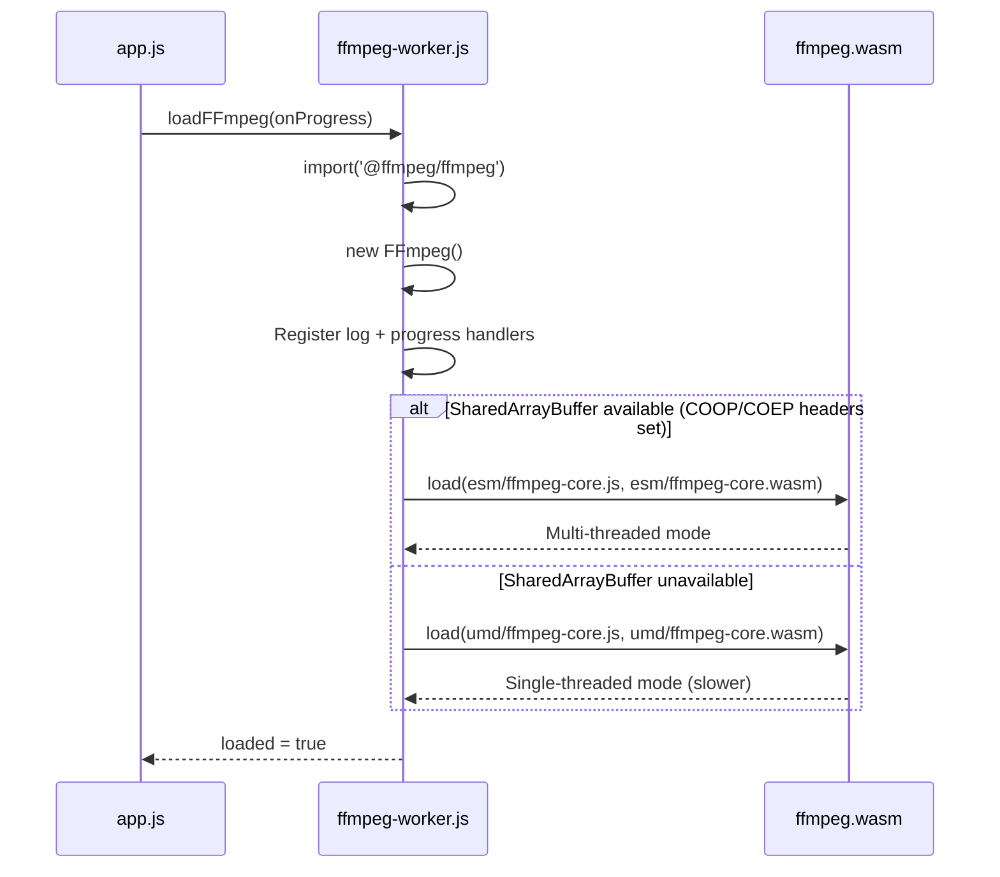
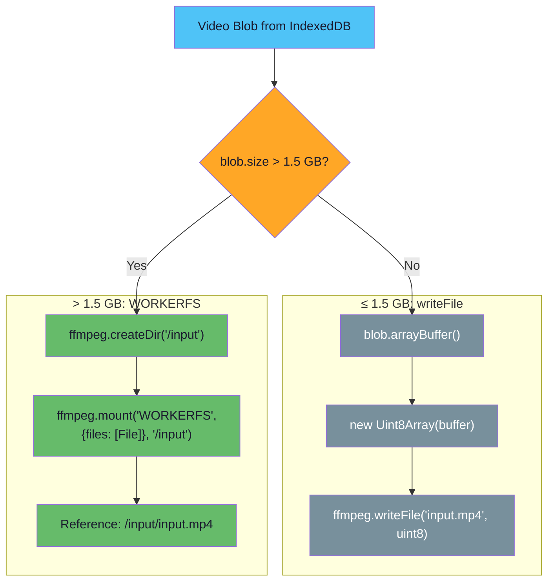
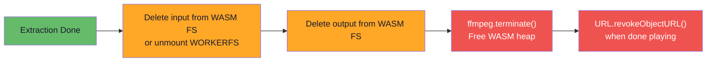

# Audio Extraction

## ffmpeg.wasm Loading



### Build Variants

| Variant | Path | SharedArrayBuffer | Performance |
|---------|------|-------------------|-------------|
| ESM (multi-threaded) | `@ffmpeg/core/dist/esm/` | Required | Fast |
| UMD (single-threaded) | `@ffmpeg/core/dist/umd/` | Not required | ~3-5x slower |

The app tries multi-threaded first and falls back automatically. Single-threaded mode still works — just slower for re-encoding operations. Stream copy (`-c:a copy`) is fast regardless.

## Input Strategy: Small vs Large Files



### Why 1.5 GB Threshold?

- `Blob.arrayBuffer()` returns an `ArrayBuffer` — limited to ~2 GB in most browsers
- `Uint8Array` backed by that buffer has the same limit
- The 1.5 GB threshold provides safety margin for the browser's own memory overhead
- WORKERFS reads from the Blob on demand without copying — zero additional memory cost

### WORKERFS Mount

WORKERFS is an Emscripten filesystem type that provides read-only access to browser `File`/`Blob` objects. ffmpeg.wasm can read from the mounted file as if it were a regular file on disk:

```
/input/input.mp4  →  reads from Blob via file.slice() internally
```

After extraction completes, the mount is cleaned up:

```js
await ffmpeg.unmount('/input');
await ffmpeg.deleteDir('/input');
```

## Extraction Command

```
ffmpeg -i input.mp4 -vn -sn -c:a copy output.aac
```

| Flag | Purpose |
|------|---------|
| `-i input.mp4` | Input file (MEMFS path or WORKERFS mount path) |
| `-vn` | No video output |
| `-sn` | No subtitle output |
| `-c:a copy` | Stream copy audio (no re-encoding) |
| `output.aac` | Output file in MEMFS |

**Stream copy is critical** — it copies the audio bitstream without decoding/re-encoding, making it:
- Extremely fast (seconds, not minutes)
- Lossless (bit-identical to the original audio track)
- Low memory (no decode buffers needed)

The output file is typically 30-50 MB for a 2-hour video, easily fitting in WASM memory.

## Downsampling for Waveform Analysis

After extraction, the audio is downsampled for efficient waveform analysis:

```
ffmpeg -i audio.aac -ac 1 -ar 16000 -f f32le -acodec pcm_f32le output.raw
```

| Flag | Purpose |
|------|---------|
| `-ac 1` | Mono (single channel) |
| `-ar 16000` | 16 kHz sample rate (default; 8 kHz for files over 2 hours) |
| `-f f32le` | Raw float32 little-endian output |
| `-acodec pcm_f32le` | 32-bit float PCM codec |

### Adaptive Sample Rate

The sample rate is chosen automatically based on estimated audio duration:

- **≤ 2 hours**: 16 kHz — smoother waveforms, better peak accuracy per pixel bucket
- **> 2 hours**: 8 kHz — halves memory usage to stay within ~460 MB budget

### Output Size

| Input Duration | 16 kHz Samples | 16 kHz Size | 8 kHz Samples | 8 kHz Size |
|---------------|---------------|-------------|--------------|------------|
| 30 min | 28.8 M | ~115 MB | 14.4 M | ~55 MB |
| 1 hour | 57.6 M | ~230 MB | 28.8 M | ~110 MB |
| 2 hours | 115.2 M | ~460 MB | 57.6 M | ~230 MB |
| 3 hours | — (falls back) | — | 86.4 M | ~330 MB |

This produces a `Float32Array` that fits comfortably in JavaScript heap memory and can be processed for peak extraction without chunking.

## Cleanup and Memory Management



After the full pipeline completes, `ffmpeg.terminate()` is called to free the entire WASM heap. Object URLs are revoked when replaced or when the page unloads.
