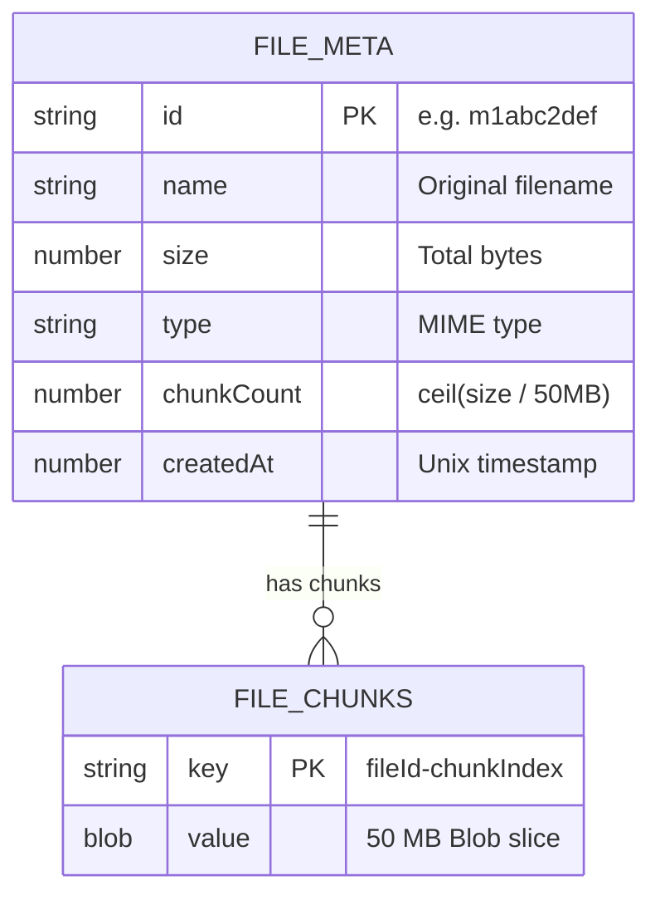
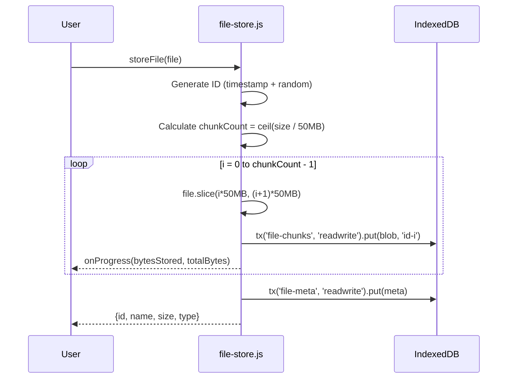
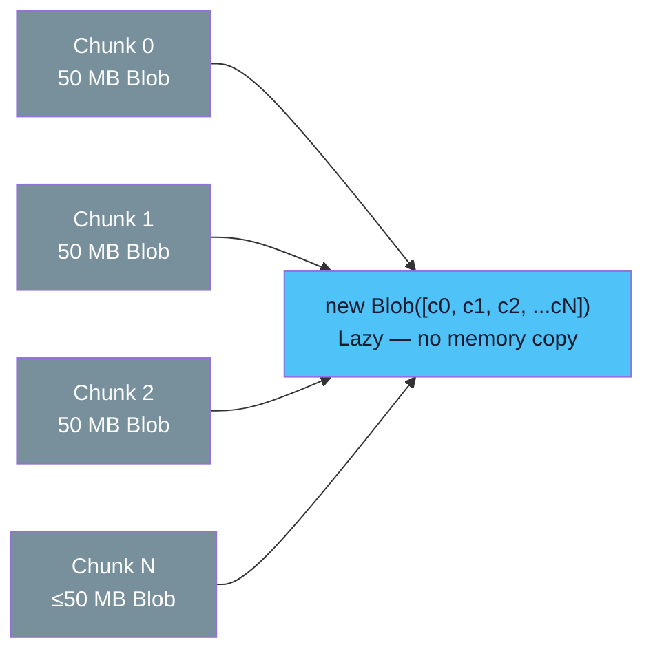
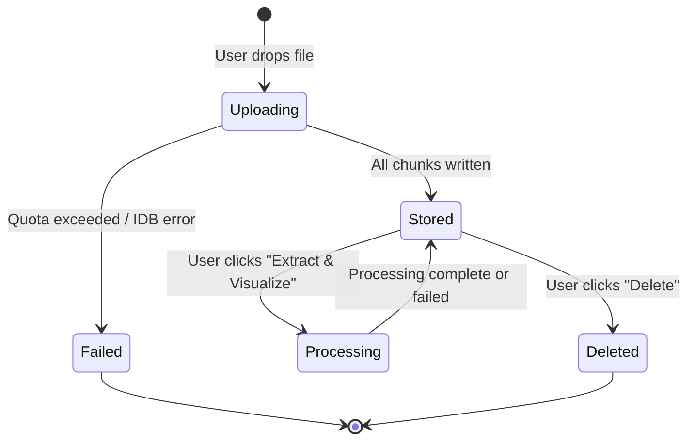

# Storage

## IndexedDB Schema



The database `audio-waveform-db` has two object stores:

| Store | Key | Value | Purpose |
|-------|-----|-------|---------|
| `file-meta` | `id` (keyPath) | Metadata object | File listing, chunk count for reassembly |
| `file-chunks` | `${fileId}-${index}` | Blob (50 MB) | Actual file data, disk-backed |

## Chunked Upload Flow



### Why 50 MB Chunks?

| Chunk Size | Pros | Cons |
|-----------|------|------|
| 1 MB | Low memory per transaction | Too many IDB transactions (slow) |
| **50 MB** | **Good balance of speed and memory** | **~50 MB peak per transaction** |
| 500 MB | Fewer transactions | May exceed IDB transaction limits |

## Blob Reassembly



`getFileAsBlob()` reads all chunks from IndexedDB and passes them to `new Blob(chunks)`. This is **lazy** — the browser does not copy the data into memory. The resulting Blob references the disk-backed IndexedDB data and only reads it when accessed (e.g., via `blob.slice()` or WORKERFS).

## Quota Management

Browser storage quotas vary:

| Browser | Default Quota | Notes |
|---------|--------------|-------|
| Chrome | ~60% of disk | Persistent storage available via `navigator.storage.persist()` |
| Firefox | ~50% of disk | Per-origin limit of ~2 GB (configurable) |
| Safari | ~1 GB | Prompts user for more; aggressive eviction |

The app checks quota on startup and before each upload using `navigator.storage.estimate()`:

```js
const { usage, quota, available } = await checkQuota();
// available = quota - usage
```

If the file exceeds available quota, the upload is rejected with a clear error message.

## File Lifecycle



Files remain in IndexedDB until explicitly deleted. They persist across page reloads, browser restarts, and even system reboots (as long as the browser does not evict the storage).
