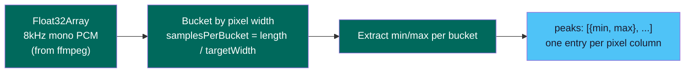
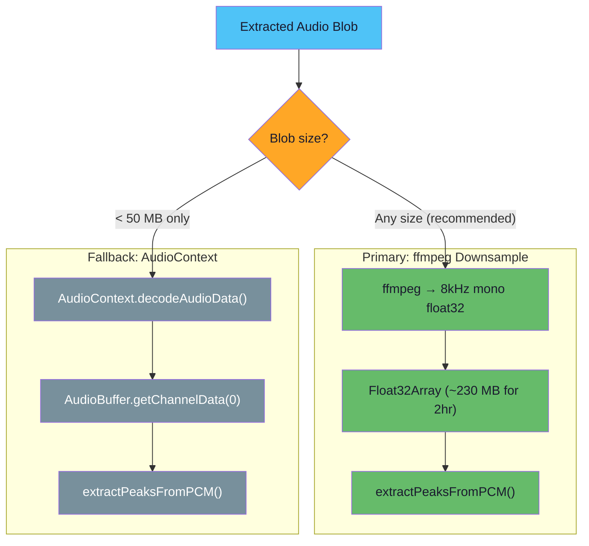
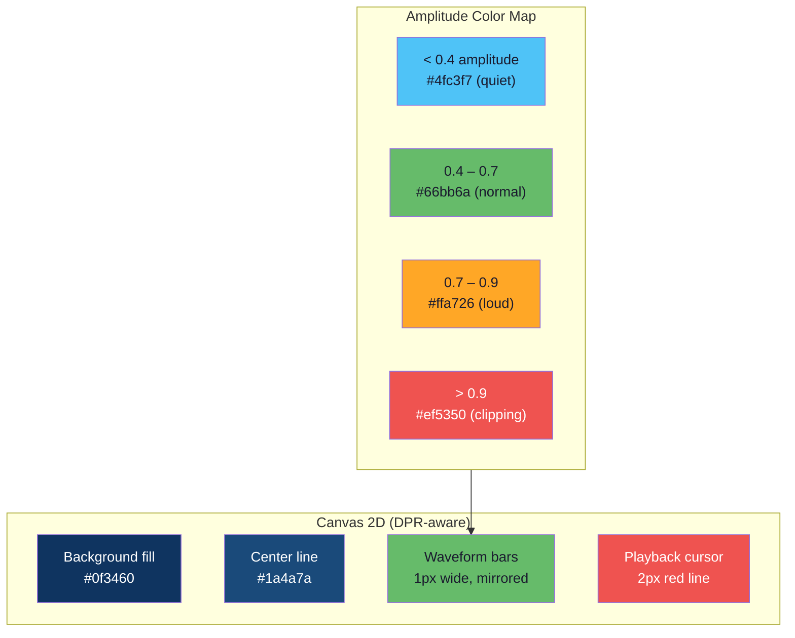
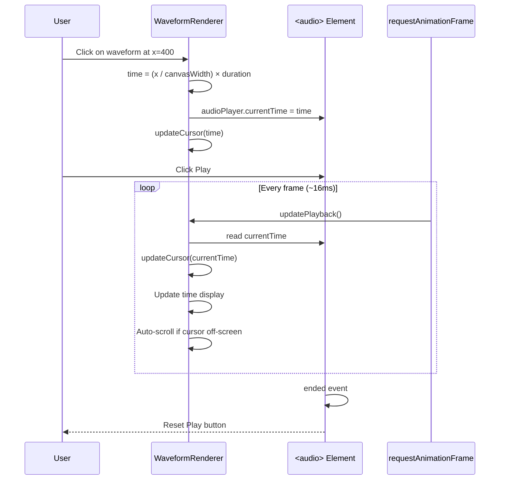

# Waveform Visualization

## Analysis Pipeline



### Peak Extraction Algorithm

For each pixel column (bucket) of the target width:

1. Calculate the range of samples: `start = i * bucketSize`, `end = start + bucketSize`
2. Scan all samples in the range to find minimum and maximum values
3. Store `{min, max}` — these represent the waveform's negative and positive peaks at that pixel

This produces one `{min, max}` pair per pixel column, giving pixel-perfect resolution regardless of audio length or canvas width.

### Analysis Strategies



The ffmpeg-based downsampling is the primary strategy because:
- Works for any file size (the downsampled output is always manageable)
- Predictable memory usage (Float32Array at 8 kHz mono)
- No browser `decodeAudioData` quirks or memory limits

The `AudioContext.decodeAudioData()` fallback is available for small files but is not used in the default pipeline.

## Canvas Rendering



### Rendering Steps

1. **Set canvas dimensions** — multiply display size by `devicePixelRatio` for crisp rendering on HiDPI screens
2. **Fill background** — dark blue (`#0f3460`)
3. **Draw center line** — horizontal line at `height / 2`
4. **Draw waveform** — for each pixel column `x`:
   - Look up `peaks[x]` → `{min, max}`
   - Calculate color based on amplitude
   - Draw a 1px-wide rectangle from `centerY + min * centerY` to `centerY + max * centerY`
5. **Show cursor** — positioned via CSS `left` property

### Zoom

Zoom changes the canvas width relative to the container:

| Zoom | Canvas Width | Effect |
|------|-------------|--------|
| 0.1x | Container / 10 | Extreme zoom out |
| **1x** | **Container width** | **Fit to view (default)** |
| 5x | Container × 5 | 5x zoom with horizontal scroll |
| 50x | Container × 50 | Maximum zoom |

When zoomed in, the container scrolls horizontally. The cursor auto-scrolls to keep the playback position visible.

## Playback Synchronization



The playback cursor position is calculated as:

```
cursorX = (currentTime / duration) × canvasWidth
```

This runs every frame via `requestAnimationFrame` for smooth 60fps cursor movement. The time display updates in sync showing `m:ss / m:ss` format.

## WaveformRenderer API

| Method | Description |
|--------|-------------|
| `setPeaks(peaks, duration)` | Set peak data and initial render |
| `render()` | Re-render at current zoom |
| `setZoom(level)` | Set absolute zoom level |
| `zoomIn()` | Zoom in by 1.5x |
| `zoomOut()` | Zoom out by 1.5x |
| `zoomFit()` | Reset to 1x (fit container) |
| `updateCursor(time)` | Move cursor to time position |
| `onSeek` | Callback when user clicks waveform |
